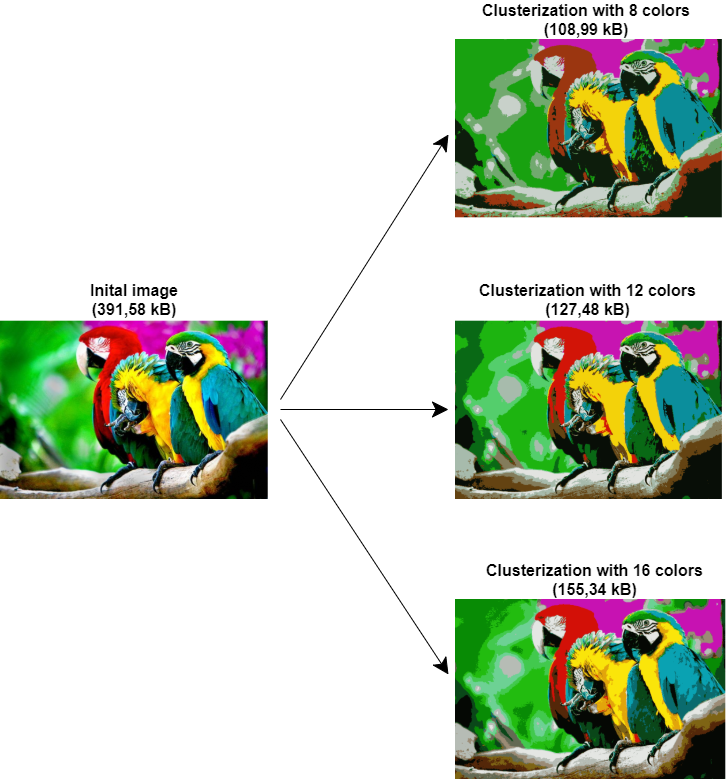

# image clustering


- [How To Install](#anc1)
- [How To Use](#anc2)
- [How To Contribute](#anc3)
- [How It Work](#anc4)
- [License](#anc5)

---
 Calculating the best image clustering parameter and get clustering image.</br>
Implemented by [Python 3.8](https://www.python.org/downloads/).

<a id="anc1"></a>

## How To Install
- The sources of project can be downloaded from the [Github repo](https://github.com/rrtty0/image_clustering.git).

* You can either clone the public repository:
```
        $ git clone https://github.com/rrtty0/image_clustering.git 
```
<a id="anc2"></a>

## How To Use

To use this project you need:
- _Open_ root-folder with this project at your local computer
- _Run_ file [image_clustering.py](./image_clustering.py):
```
        $ python classification_of_speech_recordings.py
```

<a id="anc3"></a>

## How To Contribute
1. _Clone repo_ and _create a new branch_:
```
        $ git clone https://github.com/rrtty0/image_clustering.git
        $ git branch name_for_new_branch
        $ git checkout name_for_new_branch
```
2. _Make changes_ and _test_
3. _Submit Pull Request_ with comprehensive description of changes


<a id="anc4"></a>

## How It Work

 - The source code of this program performs [image clustering](https://en.wikipedia.org/wiki/Cluster_analysis).
 
 - The method used to cluster an image is [k-means clustering](https://en.wikipedia.org/wiki/K-means_clustering).
 
 - The best number of divisions of image colors into clusters is determined according to [PSNR](https://en.wikipedia.org/wiki/Peak_signal-to-noise_ratio).



<a id="anc5"></a>

## License
Source Available License Agreement - [MIT](./LICENSE).